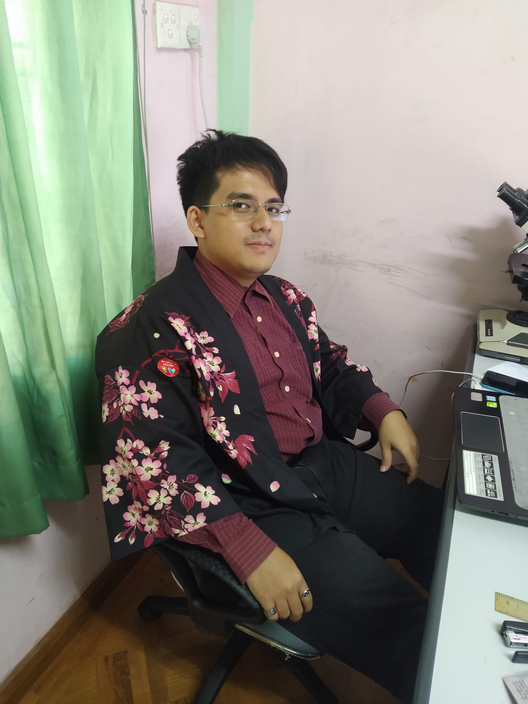

>*Location:* _Chiang Mai, Thailand_  
>*Phone:* _(+66) 654 476 375_  
>*Email:* [_sawtimothylin.rl@gmail.com_](mailto:sawtimothylin.rl@gmail.com)  
>*LinkedIn:* [_www.linkedin.com/in/saw-timothy-lin-7775b02b8_](https://www.linkedin.com/in/saw-timothy-lin-7775b02b8)

---

**PROFILE SUMMARY**

Dedicated IT student with several years of hands-on experience in IT support across corporate and laboratory environments. Recognized for strong problem-solving abilities, attention to detail, and the ability to troubleshoot hardware, software, and network issues efficiently. Highly praised by supervisors for professionalism, reliability, and a proactive approach to learning new technologies. Demonstrates excellent communication skills and patience when assisting users with varying levels of technical knowledge, creating a positive and supportive working environment. Consistently shows strong work ethic, enthusiasm for technology, and the ability to collaborate effectively with team members. Proven capability to quickly adapt to new systems, contribute to IT projects, and deliver high-quality technical support.

---

**EDUCATION**

Payap University International Program — Chiang Mai, Thailand  
Bachelor of Science in Information Technology  
Currently studying  

---

KMD Computer Training Center — Mandalay, Myanmar  
Diploma in Information Technology (2-year course)  
Grade: 80/100 (Pass)  
Certificates: A+, Java Programming, ASP.Net Web Application, Microsoft SQL Server 

---

**WORK EXPERIENCE**

Concordia International Co., Ltd — Mandalay, Myanmar  
IT Support | May 2023 – 2024  
Diagnosed and resolved hardware, software, and network issues  
Installed and upgraded IT systems and applications  
Supported end-users and resolved technical errors efficiently  
Built and configured new PCs  
Photo editing and digital material updates (Photoshop)  

Right Laboratory & Health Screen — Mandalay, Myanmar  
IT Support | Feb 2019 – May 2023  
Provided technical support for laboratory and office IT systems  
Troubleshot network, hardware, and software problems  
Assisted with implementation of IT projects  
Supported daily operations through reliable maintenance and system updates  
Built new PCs and configured devices for staff use  

---

**TECHNICAL SKILLS**

Hardware & Network Troubleshooting  
Java Programming  
ASP.NET Web Application  
Microsoft SQL Server  
IT System Deployment / Installation  
PC Building  
Photoshop (Photo Editing)  

---

**LANGUAGES**

Myanmar (Native)  
English (Intermediate)  

---

**INTERESTS**

Drawing  
Learning new technologies  
Video games  

---

**RECOMMENDATION LETTERS**

Concordia International Co., Ltd  
Dr. Khin Mar Swe  
Branch Manager  
Concordia Co., Ltd  
Date: May 24, 2024  
The letter highlights that:  
Tim shows exceptional skills, dedication, and enthusiasm in IT  
Strong problem-solving ability and attention to detail  
Professional in handling hardware/software issues  
Highly effective in supporting users with different technical backgrounds  
A valuable resource for the organization  
Recommended as a suitable candidate for IT roles and further studies abroad  

Right Laboratory & Health Screen  
Dr. Htet Oo Lwin  
Assistant Corporate Manager  
Right Laboratory & Health Care  
Date: March 2023  
The letter states that Tim:  
Demonstrates a remarkable ability to learn new technologies  
Shows strong work ethic, initiative, and enthusiasm  
Played an essential role in the smooth operation of IT systems  
Highly effective in user support and troubleshooting  
Works well collaboratively with team members  
Recommended as an excellent candidate for IT roles and study opportunities abroad  

